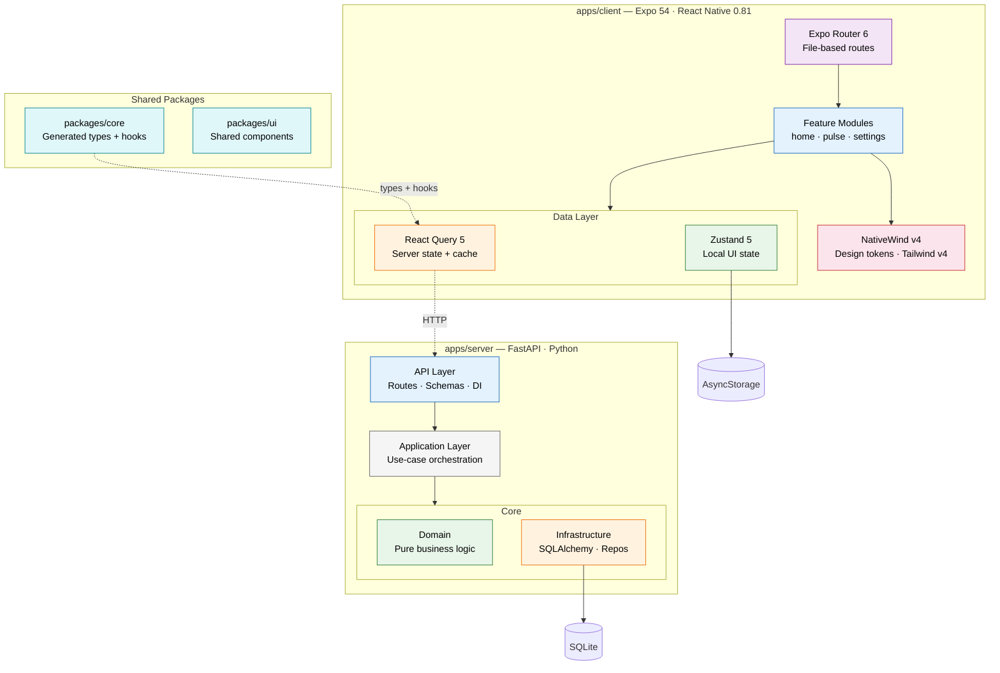

# agentic-rn-demo

A full-stack monorepo demonstrating **architecture-first development with
AI-assisted workflows** — built with Expo (iOS, Android, Web) and FastAPI.

Created for a developer meetup talk: _"Architecture-First Development in the Age
of Agents — Practical React Native workflows with AI"_

## What This Project Demonstrates

- **Layered AGENTS.md files** — progressive disclosure from root → app → feature
  so AI agents understand the codebase at every level
- **Story-driven development** — every change starts with a written spec in
  `docs/STORIES/`, synced to a GitHub project board
- **Hexagonal architecture** — clean separation of domain, application, and
  infrastructure on both client and server
- **Generated API contracts** — OpenAPI spec → TypeScript types + React Query
  hooks via Orval, ensuring client and server stay in sync
- **Git hooks as quality gates** — Lefthook enforces formatting, linting,
  type-checking, and commit conventions for both humans and AI agents

## Architecture



Arrows show allowed imports — each layer may only import from layers below it.

For the full system architecture with all sub-layers, see [`docs/ARCHITECTURE.md`](docs/ARCHITECTURE.md).

## Tech Stack

| Layer      | Technology                                           |
| ---------- | ---------------------------------------------------- |
| Client     | Expo 54, React Native 0.81, React 19                 |
| Routing    | Expo Router 6 (file-based)                           |
| Styling    | NativeWind v4 + Tailwind CSS v4, design tokens       |
| State      | Zustand 5 (local), TanStack React Query 5 (server)   |
| Server     | FastAPI, SQLAlchemy 2.x, Pydantic                    |
| Database   | SQLite (swappable to PostgreSQL via `DATABASE_URL`)  |
| API Client | Orval-generated hooks + types from OpenAPI spec      |
| Tooling    | pnpm workspaces, Volta (Node 22), Lefthook, Prettier |

## Features

### Home Dashboard

Full dashboard landing screen with navigation cards, team pulse widget, and
activity feed.

### Team Pulse

Mood tracking dashboard — view team members, submit mood entries, see mood
distribution, and generate AI standup summaries from team data.

### Settings

User preferences with dark mode toggle and username editing, persisted to the
backend API.

## Quick Start

```bash
# Prerequisites: Node 22 (managed by Volta), pnpm, Python 3.11+, uv

# Install dependencies
pnpm install

# Start client only
pnpm dev

# Start client + server together
pnpm dev:all

# Start server only
pnpm dev:server
```

The client runs on `http://localhost:8081` and the server on `http://localhost:8000`.

## Project Structure

```
agentic-rn-demo/
├── apps/
│   ├── client/              Expo app — iOS, Android, Web
│   │   ├── app/             File-based routes (Expo Router)
│   │   └── src/
│   │       ├── features/    Self-contained feature modules
│   │       │   ├── home/    Dashboard with widgets
│   │       │   ├── pulse/   Team mood tracking + AI standup
│   │       │   └── settings/ User preferences
│   │       ├── store/       Zustand stores (local state only)
│   │       ├── theme/       Design tokens + NativeWind bridge
│   │       └── lib/         Shared types, hooks, utilities
│   └── server/              FastAPI backend (hexagonal architecture)
│       └── src/
│           ├── api/         Routes, schemas, dependencies
│           ├── application/ Service layer (use-case orchestration)
│           ├── domain/      Pure business logic + validation
│           ├── infrastructure/ Database, ORM, repositories
│           └── seeds/       Demo data seeding
├── packages/
│   ├── core/                Generated API client, types, React Query hooks
│   └── ui/                  Shared UI component library
└── docs/
    ├── ARCHITECTURE.md      System diagrams, DB schema, folder maps
    ├── WORKFLOW.md           Dev process + PR checklist
    ├── STORIES/             Feature specs with acceptance criteria
    ├── ADR/                 Architecture Decision Records (10 ADRs)
    ├── audits/              Architecture + AI strategy audits
    └── guides/              Developer onboarding guide
```

## API Endpoints

| Endpoint                        | Method | Description              |
| ------------------------------- | ------ | ------------------------ |
| `/health`                       | GET    | Health check             |
| `/api/v1/preferences/{user_id}` | GET    | Get user preferences     |
| `/api/v1/preferences/{user_id}` | PUT    | Update user preferences  |
| `/api/v1/team`                  | GET    | List all team members    |
| `/api/v1/team/{id}`             | GET    | Get a single team member |
| `/api/v1/team/{id}/mood`        | POST   | Submit a mood entry      |

Interactive API docs available at `GET /docs` (Swagger UI) when the server is running.

## Scripts

| Command             | Description                             |
| ------------------- | --------------------------------------- |
| `pnpm dev`          | Start Expo dev server                   |
| `pnpm dev:server`   | Start FastAPI server with hot reload    |
| `pnpm dev:all`      | Start client + server concurrently      |
| `pnpm lint`         | Lint all packages                       |
| `pnpm format`       | Format with Prettier                    |
| `pnpm typecheck`    | TypeScript check all packages           |
| `pnpm generate:api` | Regenerate API client from OpenAPI spec |

## Documentation

| Document               | Purpose                                   |
| ---------------------- | ----------------------------------------- |
| `AGENTS.md` (3 levels) | AI agent context — root, app, and feature |
| `CLAUDE.md`            | Claude Code session configuration         |
| `docs/ARCHITECTURE.md` | System diagrams, DB schema, folder maps   |
| `docs/WORKFLOW.md`     | Development process and PR checklist      |
| `docs/STORIES/`        | Feature specs with acceptance criteria    |
| `docs/ADR/`            | Architecture Decision Records             |
| `docs/guides/`         | Developer onboarding and troubleshooting  |

## Architecture Decisions

This project has 10 documented ADRs covering key decisions:

1. pnpm monorepo structure
2. Expo SDK 54 as the app framework
3. Layered client architecture
4. Zustand for client-only state
5. Expo Router for file-based navigation
6. Service interface pattern
7. Layered AGENTS.md for AI context
8. Story-driven development workflow
9. Renaming `mobile` to `client` for cross-platform clarity
10. Hexagonal backend architecture

See `docs/ADR/README.md` for the full index.
