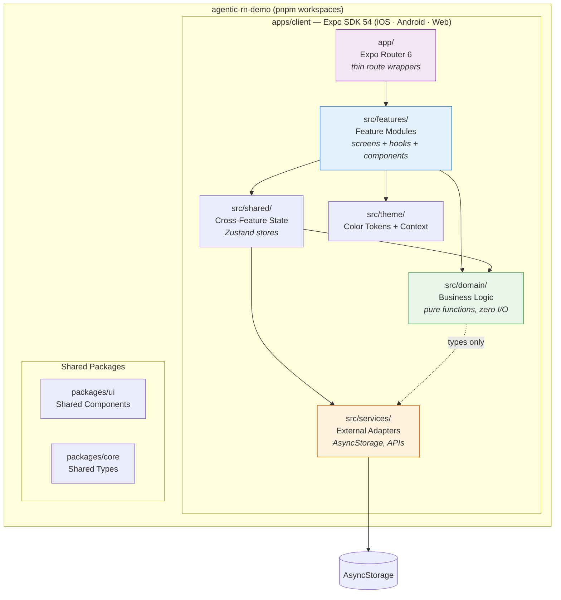
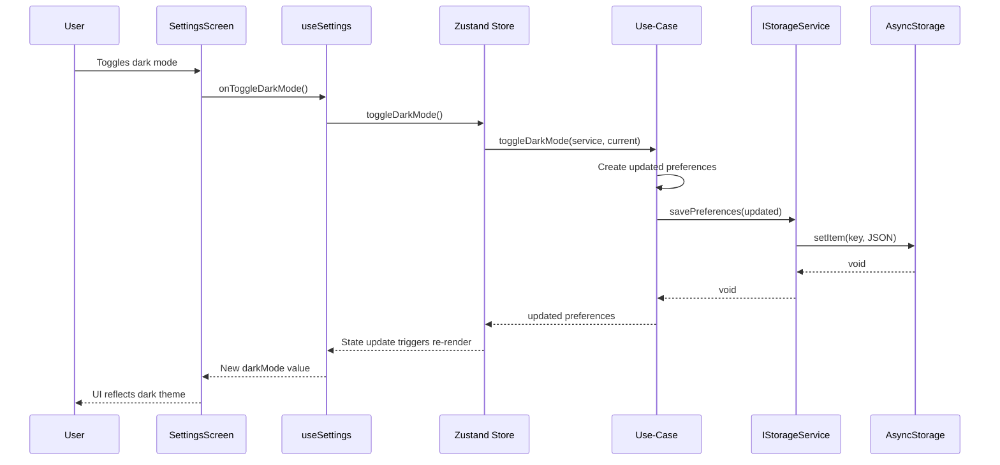
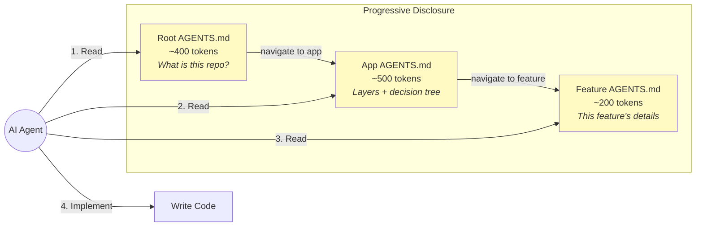
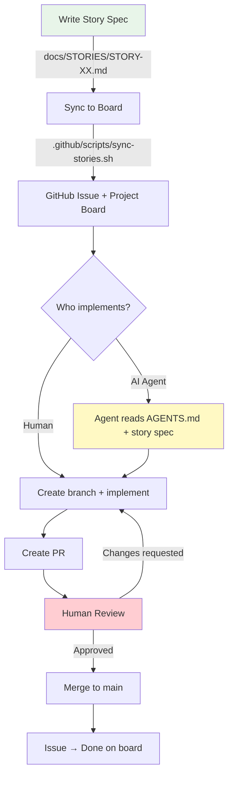

# Architecture

## Overview

This app follows a **layered architecture** with strict dependency rules.
It targets iOS, Android, and Web from a single codebase using Expo.
The goal is clear boundaries, testable logic, and a codebase that both humans
and AI agents can navigate predictably.

> For the rationale behind each decision, see [docs/ADR/](./ADR/).

---

## System Architecture



**Dependency Rule**: Arrows show allowed imports. Each layer may only import from layers below it. Never up.

---

## Data Flow



---

## Agent Context Flow



Total context per task: **~1,100 tokens** across 3 files.

---

## Development Workflow



---

## Layers

```
┌─────────────────────────────────────────────┐
│  app/              Routing (Expo Router)     │  ← Thin wrappers only
├─────────────────────────────────────────────┤
│  src/features/     Feature Modules           │  ← Screens + hooks + UI
├─────────────────────────────────────────────┤
│  src/shared/       Cross-Feature State       │  ← Zustand stores
├─────────────────────────────────────────────┤
│  src/domain/       Business Logic            │  ← Pure functions, zero I/O
├─────────────────────────────────────────────┤
│  src/services/     External Integrations     │  ← AsyncStorage, APIs
└─────────────────────────────────────────────┘
```

## Folder Structure

```
apps/client/
├── app/                          # Route definitions (Expo Router)
│   ├── _layout.tsx               # Root layout + providers
│   ├── index.tsx                 # → HomeScreen
│   └── settings.tsx              # → SettingsScreen
│
├── src/
│   ├── domain/                   # Pure business logic
│   │   ├── entities/             # Data shapes (interfaces/types)
│   │   │   └── UserPreferences.ts
│   │   └── use-cases/            # Pure functions with injected deps
│   │       └── preferences.ts
│   │
│   ├── services/                 # External system adapters
│   │   ├── interfaces/           # Contracts (no implementations)
│   │   │   └── IStorageService.ts
│   │   └── storage/              # Concrete implementations
│   │       └── asyncStorageService.ts
│   │
│   ├── features/                 # Feature modules
│   │   ├── home/                 # Home screen feature
│   │   │   ├── HomeScreen.tsx
│   │   │   └── AGENTS.md         # Feature-level agent guide
│   │   └── settings/             # Settings screen feature
│   │       ├── SettingsScreen.tsx
│   │       ├── hooks/useSettings.ts
│   │       └── AGENTS.md         # Feature-level agent guide
│   │
│   ├── shared/                   # Cross-feature concerns
│   │   └── store/
│   │       └── preferencesStore.ts
│   │
│   └── theme/                    # Visual theming
│       ├── colors.ts             # Light/dark color tokens
│       └── ThemeContext.tsx       # React 19 Context provider
│
packages/
├── core/                         # Shared types & utilities
│   └── src/types.ts              # Result<T, E> type
└── ui/                           # Shared UI components
    └── src/Button.tsx            # Reusable Button component
```

## How to Add a New Feature

1. **Write a story spec**: `docs/STORIES/STORY-XX-{feature-name}.md`
2. **Sync to board**: `.github/scripts/sync-stories.sh`
3. **Create the feature folder**: `src/features/{feature-name}/`
4. **Add the screen**: `{FeatureName}Screen.tsx`
5. **Add a feature-level AGENTS.md** describing purpose, files, dependencies
6. **Create a route file**: `app/{feature-name}.tsx` that re-exports the screen
7. **If new data is needed**:
   - Add entity in `domain/entities/`
   - Add use-case in `domain/use-cases/`
   - Add store or extend existing store in `shared/store/`
8. **If external integration is needed**:
   - Add interface in `services/interfaces/`
   - Add implementation in `services/{provider}/`
