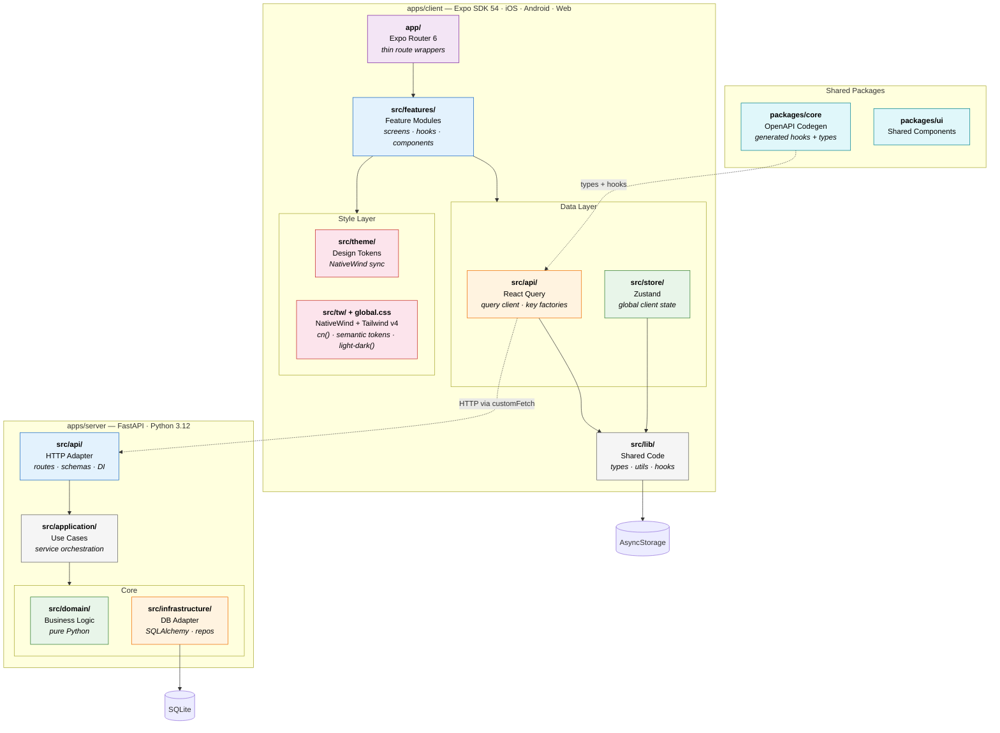
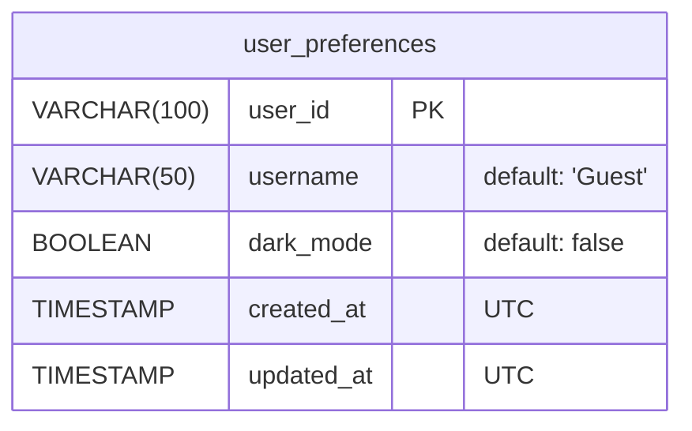
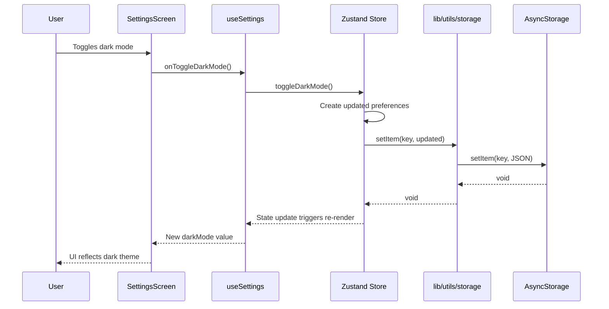
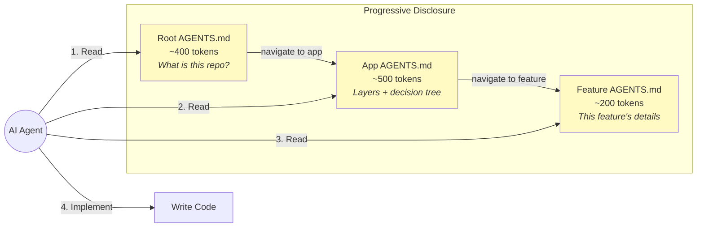
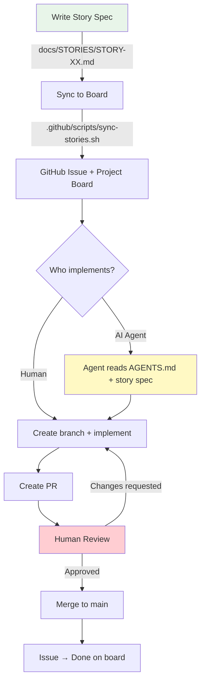

# Architecture

Last updated: 2026-02-26

## Overview

This app follows a **lightweight frontend architecture** targeting iOS, Android,
and Web from a single codebase using Expo, backed by a **hexagonal FastAPI
server**. The goal is clear boundaries, minimal boilerplate, and a codebase
that both humans and AI agents can navigate predictably.

> For the rationale behind each decision, see [docs/ADR/](./ADR/).

---

## System Architecture



**Dependency Rule**: Arrows show allowed imports. Each layer may only import from layers below it. Never up.

---

## Database Schema

Currently: **SQLite** (swappable to PostgreSQL or other databases via `DATABASE_URL`).

> **Rule**: This diagram must be updated in the same PR as any migration that
> changes tables, columns, or relationships. It must always reflect the current
> state of the database.



### Column Reference

| Table              | Column       | Type           | Constraints | Notes                              |
| ------------------ | ------------ | -------------- | ----------- | ---------------------------------- |
| `user_preferences` | `user_id`    | `VARCHAR(100)` | PK          | Alphanumeric, hyphens, underscores |
| `user_preferences` | `username`   | `VARCHAR(50)`  | NOT NULL    | Display name                       |
| `user_preferences` | `dark_mode`  | `BOOLEAN`      | NOT NULL    | UI preference                      |
| `user_preferences` | `created_at` | `TIMESTAMP`    | NOT NULL    | UTC, set on creation               |
| `user_preferences` | `updated_at` | `TIMESTAMP`    | NOT NULL    | UTC, set on every write            |

---

## Data Flow



---

## Agent Context Flow



Total context per task: **~1,100 tokens** across 3 files.

---

## Development Workflow



---

## Layers

```
┌─────────────────────────────────────────────────┐
│  app/              Routing (Expo Router)         │  ← Thin wrappers only
├─────────────────────────────────────────────────┤
│  src/features/     Feature Modules               │  ← Screens + hooks + UI
├─────────────────────────────────────────────────┤
│  src/store/        Zustand Stores                │  ← Global state
│  src/api/          React Query                   │  ← Async data fetching
├─────────────────────────────────────────────────┤
│  src/lib/          Shared Code                   │  ← Types, utils, hooks
│  src/theme/        Design Tokens + Theme Sync    │  ← tokens.ts, ThemeContext
│  src/tw/           NativeWind Re-exports         │  ← cn(), styled components
│  src/global.css    Tailwind CSS v4 Design System │  ← Scales, semantic tokens
└─────────────────────────────────────────────────┘
```

## Folder Structure

```
apps/client/
├── app/                          # Route definitions (Expo Router)
│   ├── _layout.tsx               # Root layout + providers + global.css import
│   ├── index.tsx                 # → HomeScreen
│   └── settings.tsx              # → SettingsScreen
│
├── src/
│   ├── api/                      # React Query infrastructure
│   │   ├── queryClient.ts        # QueryClient config
│   │   ├── keys.ts               # Query key factory
│   │   └── index.ts              # Barrel export
│   │
│   ├── features/                 # Feature modules
│   │   ├── home/                 # Home screen feature
│   │   │   ├── HomeScreen.tsx
│   │   │   └── AGENTS.md
│   │   └── settings/             # Settings screen feature
│   │       ├── SettingsScreen.tsx
│   │       ├── hooks/useSettings.ts
│   │       └── AGENTS.md
│   │
│   ├── lib/                      # Shared non-UI code
│   │   ├── types/                # Shared type definitions
│   │   │   ├── preferences.ts
│   │   │   └── index.ts
│   │   ├── utils/                # Utility functions
│   │   │   ├── storage.ts        # AsyncStorage wrapper
│   │   │   └── index.ts
│   │   └── hooks/                # Shared hooks
│   │       └── index.ts
│   │
│   ├── store/                    # Zustand stores
│   │   ├── preferencesStore.ts
│   │   └── index.ts
│   │
│   ├── theme/                    # Design tokens + NativeWind bridge
│   │   ├── tokens.ts             # Deloitte brand constants, scales, vars()
│   │   └── ThemeContext.tsx       # useThemeSync() + useRawColors()
│   │
│   ├── tw/                       # NativeWind component layer
│   │   └── index.tsx             # RN re-exports + cn() utility
│   │
│   └── global.css                # Tailwind CSS v4 design system
│                                 # (scales, semantic tokens, light-dark())
│
├── metro.config.js               # withNativeWind() wrapper
├── postcss.config.mjs            # @tailwindcss/postcss plugin
├── nativewind-env.d.ts           # NativeWind type declarations
└── tsconfig.json                 # Path aliases (@/tw, @/theme, etc.)

packages/
├── core/                         # OpenAPI codegen (orval)
│   ├── openapi.json              # API spec (source of truth)
│   └── src/
│       ├── generated/            # Auto-generated hooks + types
│       ├── fetcher.ts            # Custom fetch wrapper
│       └── index.ts              # Barrel export
└── ui/                           # Shared UI components (future)
    └── src/Button.tsx            # Reusable Button component
```

## How to Add a New Feature

1. **Write a story spec**: `docs/STORIES/STORY-XX-{feature-name}.md`
2. **Sync to board**: `.github/scripts/sync-stories.sh`
3. **Create the feature folder**: `src/features/{feature-name}/`
4. **Add the screen**: `{FeatureName}Screen.tsx`
5. **Add a feature-level AGENTS.md** describing purpose, files, dependencies
6. **Create a route file**: `app/{feature-name}.tsx` that re-exports the screen
7. **If new data is needed**:
   - Add types in `lib/types/`
   - Add or extend a Zustand store in `store/`
8. **If API integration is needed**:
   - Update OpenAPI spec in `packages/core/openapi.json`
   - Run `pnpm generate:api` to regenerate hooks + types
   - Use the generated hook from `@agentic-rn/core` in your feature
